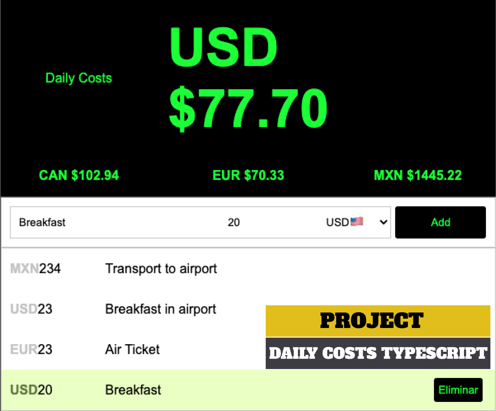

## 🇺🇸First front-end application with Typescript/🇫🇷Première application frontale avec Typescript/

  

🇺🇸In this tutorial you will learn basic concepts of Typescript to create your 1st front-end app.
The topics we will cover in this tutorial are:
-Native types: number, boolean, null
-Optional values

🇫🇷Dans ce didacticiel, vous apprendrez les concepts de base de Typescript pour créer votre première application frontale.
Les sujets que nous aborderons dans ce tutoriel sont :
-Types natifs : nombre, booléen, null
-Valeurs facultatives
